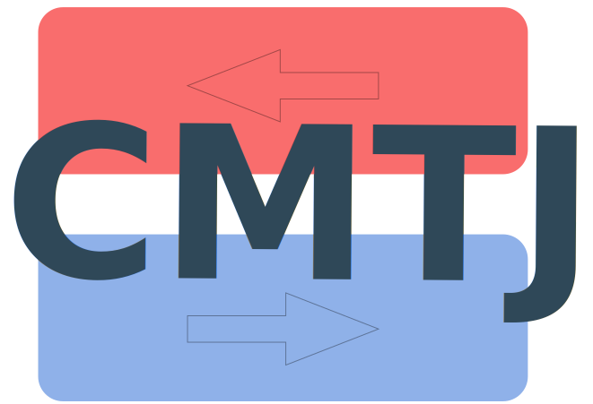

# CMTJ

[](https://github.com/LemurPwned/cmtj/actions/workflows/main.yml)
[](https://github.com/LemurPwned/cmtj/actions/workflows/pages/pages-build-deployment)

## Short description

The library allows for macromagnetic simulation of multilayer spintronic structures.
A name may be misleading -- the MTJ (Magnetic Tunnel Junctions) are not the only structures that may be simulated.

## Quickstart

#### Installation :rocket:

Installation is as easy as doing:

```bash
python3 -m pip install cmtj
```

If you prefer to clone the repo first and then install directly from the source:

```bash
git clone https://github.com/LemurPwned/cmtj.git
python3 -m pip install .
```

#### Read the docs

Documentation: [https://lemurpwned.github.io/cmtj](https://lemurpwned.github.io/cmtj)

## WIKI :mortar_board:

Read more in do [the docs here](https://lemurpwned.github.io/cmtj/).

## Extensions

There's a GUI version available! If you wish to conduct a subset of simulations, mainly for experimental modelling, please see the _PyMag_ project. It uses CMTJ as a backend for fast computation.

## Citing

Please cite if you decide to use the project

```bibtex
@article{zietek_numerical_2022,
	title = {Numerical Model Of Harmonic Hall Voltage Detection For Spintronic Devices},
	url = {https://arxiv.org/abs/2202.00364v1},
	author = {Ziętek, Sławomir and Mojsiejuk, Jakub and Grochot, Krzysztof and Łazarski, Stanisław and Skowroński, Witold and Stobiecki, Tomasz},
	urldate = {2022-02-03},
	date = {2022-02-01}
}
```

## Development

## Contributions

All contributions are welcome, please leave an issue if you've encountered any trouble with setup or running the library.

## Precommit

There's a `.pre-commit-config.yaml` that does some basic python and cpp lints and checks. More static analysis to come in the future.
This may be run by

```
pre-commit run -v
```

or

```
pre-commit run -a (or --files core/* cmtj/*)
```

## Documentation builds

There are couple of stages to building the documentation

1. Build Doxygen documentation
   ```
   doxygen Doxyfile
   ```
   This is mostly for the C++ documentation. Furture changes may couple C++ and Python docs.
2. Build stubs
   The stubgen is `pybind11-stubgen` or `mypy stubgen` with the latter being preferred now.
   E.g. to generate `Stack` module stubs we can go:
   ```
   stubgen -m cmtj.stack -o target-stub-dir/
   ```
   More info here: https://mypy.readthedocs.io/en/stable/stubgen.html.
3. Parse stubs to Markdown.
   This stage is done by running:
   `bash python3 docs/docgen.py `
   The deployment of the documentation is done via:

```bash
mkdocs gh-deploy
```
