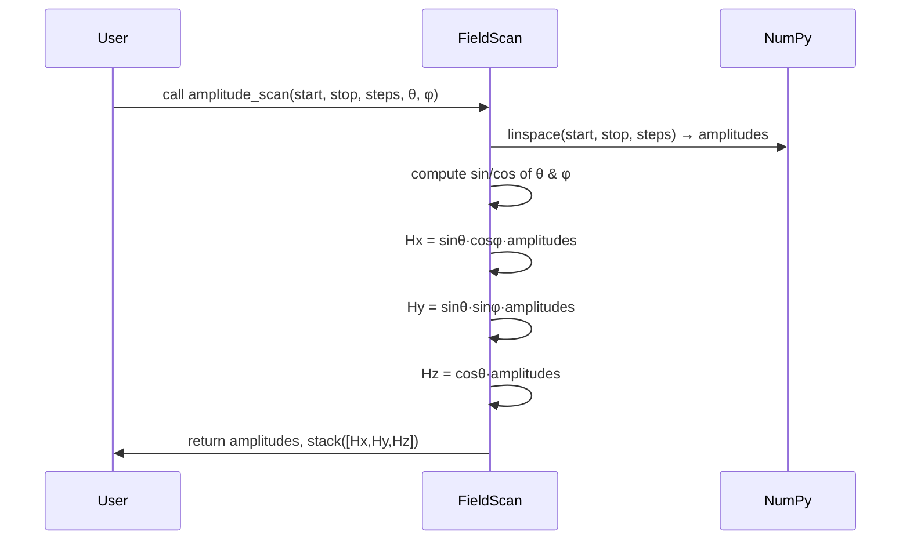

# Chapter 2: FieldScan Utilities

Welcome back! In [Chapter 1: PIMM & VSD Procedures](01_pimm___vsd_procedures_.md) we saw how to run common micromagnetic experiments. Now, before we drive those simulations, we need to generate the lists of magnetic‐field vectors that sweep over amplitudes or directions. That’s where **FieldScan Utilities** come in—turning simple numeric ranges into ready‑to‑use `(Hx, Hy, Hz)` sequences.

---

## 1. Motivation & Central Use Case

Imagine you want to:

1. Sweep the strength of an applied magnetic field from 0 to 1×10^5 A/m in 10 steps.
2. Always point that field at a 45° tilt from the z‑axis (polar θ)
   and 30° around the z‑axis (azimuth φ).
3. Feed those field vectors into `PIMM_procedure` or `VSD_procedure`.

Without FieldScan, you'd manually compute sin(θ), cos(φ), multiply by each amplitude, pack into arrays… tedious and error‑prone.
With FieldScan, you call one method and get back both the list of amplitudes **and** the matched `(Hx,Hy,Hz)` waypoints—just like plotting a route on a map.

---

## 2. Key Concepts

1. **Spherical Coordinates**

   - **Amplitude** (radius): how strong the field is.
   - **Polar angle θ**: tilt measured from the +z‑axis (0° = straight up).
   - **Azimuthal angle φ**: rotation around the z‑axis (0° = +x direction).

2. **Conversion Routines**

   - `angle2vector(θ, φ, amplitude)` → Cartesian vector `CVector(x,y,z)`.
   - `vector2angle(x, y, z)` → `(θ, φ, amplitude)`.

3. **Scan Types**
   - **Amplitude scan**: vary magnitude, keep angles fixed.
   - **θ‑scan**: vary polar angle, keep magnitude & φ fixed.
   - **φ‑scan**: vary azimuth, keep magnitude & θ fixed.

---

## 3. Using FieldScan to Solve Our Use Case

Here’s how to get 10 field vectors from 0 → 1×10^5 A/m at θ=45°, φ=30°:

```python
import numpy as np
from cmtj.utils.linear import FieldScan

# 1. Choose sweep parameters
start_H = 0.0
stop_H  = 1e5      # A/m
steps   = 10
theta   = 45.0     # degrees
phi     = 30.0     # degrees

# 2. Generate amplitude list and H‑vectors
Hspan, Hvecs = FieldScan.amplitude_scan(start_H, stop_H, steps, theta, phi)

print("Amplitudes:", Hspan)
print("First H‑vector:", Hvecs[0])
print("Last  H‑vector:", Hvecs[-1])
```

After running this, you’ll see:

- `Hspan` is a 1D array of 10 magnitudes from 0 to 1×10^5 A/m.
- `Hvecs` is a 10×3 array: each row is `[Hx,Hy,Hz]` matching that amplitude.

You can now feed `Hvecs` directly into your high‑level procedures:

```python
spectrum, freqs, data = PIMM_procedure(
  junction,
  Hvecs,
  int_step=1e-12,
  resistance_params=res_params
)
```

---

## 4. What Happens Under the Hood?

Here’s a simple sequence of what `FieldScan.amplitude_scan` does:



Essentially, it takes a 1D “radius” array and projects it into 3D via spherical‐to‐Cartesian math.

---

## 5. Peek at the Code

The implementation lives in `cmtj/utils/linear.py`. Here’s a simplified view of `angle2vector` and `amplitude_scan`:

```python
# File: cmtj/utils/linear.py
import numpy as np
from cmtj import CVector

class FieldScan:
    @staticmethod
    def angle2vector(theta, phi, amplitude=1):
        # Convert angles from deg to rad
        th = np.deg2rad(theta)
        ph = np.deg2rad(phi)
        # spherical→Cartesian
        x = np.sin(th) * np.cos(ph) * amplitude
        y = np.sin(th) * np.sin(ph) * amplitude
        z = np.cos(th) * amplitude
        return CVector(x, y, z)

    @staticmethod
    def amplitude_scan(start, stop, steps, theta, phi, back=False):
        # 1) Make a line of amplitudes
        Hspan = np.linspace(start, stop, num=steps)
        # 2) Reuse angle2vector math in bulk
        # (vectorized below to avoid loops)
        th = np.deg2rad(theta)
        ph = np.deg2rad(phi)
        s, c = np.sin(th), np.cos(th)
        cp, sp = np.cos(ph), np.sin(ph)
        Hx = s * cp * Hspan
        Hy = s * sp * Hspan
        Hz = c * Hspan
        Hvecs = np.vstack((Hx, Hy, Hz)).T
        return Hspan, Hvecs
```

- **`angle2vector`**: one‐off conversion from `(θ,φ,amplitude)` to `CVector(x,y,z)`.
- **`amplitude_scan`**: bulk version that avoids Python loops by using NumPy broadcasting.

---

## 7. Conclusion & Next Steps

You’ve learned how **FieldScan Utilities** take simple numeric ranges and angles, and produce full Cartesian field sequences—your “waypoints” for any simulation drive. Next, we’ll see how to turn those static fields into time‑dependent pulses or sine drives with [Time‑Dependent Drivers (ScalarDriver & AxialDriver)](03_time_dependent_drivers__scalardriver___axialdriver__.md).

---

Generated by [AI Codebase Knowledge Builder](https://github.com/The-Pocket/Tutorial-Codebase-Knowledge)
