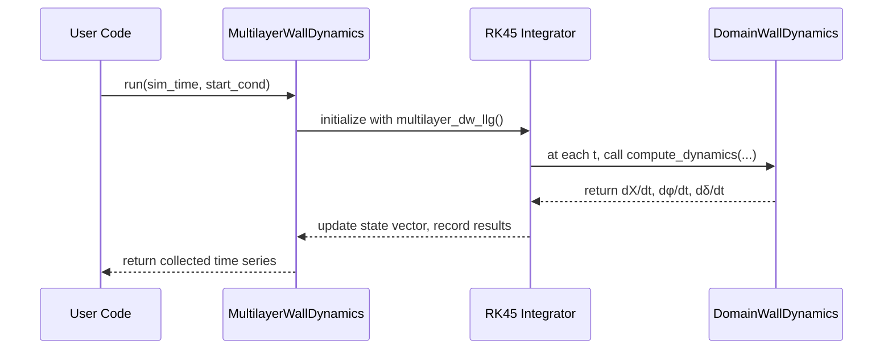
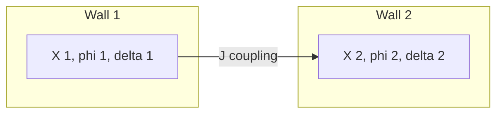

# Chapter 5: Domain Wall Dynamics (DomainWallDynamics & MultilayerWallDynamics)

Welcome back! In [Chapter 4: Magnetic Layer Models (LayerSB & LayerDynamic)](04_magnetic_layer_models__layersb___layerdynamic__.md) we learned how to describe uniform films and compute their FMR. Now we turn our attention to **domain walls**—the boundaries between “up” and “down” regions in a magnet—and see how to simulate their motion under fields, currents, pinning, and interlayer coupling.

---

## 1. Motivation & Central Use Case

Imagine you have a nanowire with a single domain wall and you want to know:

1. How fast the wall moves when you apply a spin‑Hall current pulse.
2. How its internal angle (`φ`) tilts over time.
3. How the wall width (`δ`) adapts dynamically (or is pinned by imperfections).

Or imagine two walls in adjacent layers that interact like **train cars**—the front car pulls the next one via an interlayer coupling `J`.

With `DomainWallDynamics` and `MultilayerWallDynamics` you get a **1D “collective coordinate”** model: each wall is just three numbers—position `X`, angle `φ`, width `δ`—and a set of ODEs describes how they evolve. `MultilayerWallDynamics` then glues one or two walls together and integrates them via an adaptive Runge–Kutta solver (`RK45`).

Here’s how to solve our single‑wall use case in just a few lines of code.

---

## 2. Key Concepts

• **X**, **φ**, **δ**

- X: center of the wall along the wire
- φ: internal magnetization angle (e.g. Néel or Bloch type)
- δ: domain‑wall width

• **DomainWallDynamics**

- Holds all material parameters (Ms, α, DMI, anisotropies, pinning strength…)
- Knows the external field **H** and any time‑dependent current via `set_current_function`
- Computes `dX/dt`, `dφ/dt`, `dδ/dt` at each time

• **MultilayerWallDynamics**

- Takes one or two `DomainWallDynamics` objects
- Adds an interlayer coupling term `J` (zero for single wall)
- Packs all `X`, `φ`, `δ` into one big state vector
- Uses SciPy’s `RK45` to step the ODEs and record trajectories

---

## 3. How to Use: Simple Example

```python
from cmtj.models.domain_dynamics import DomainWallDynamics, MultilayerWallDynamics, DW
from cmtj.utils.general import VectorObj

# 1) Define an external field along +z (100 kA/m)
H_ext = VectorObj(0, 0, 1e5)

# 2) Create a single-wall dynamics object
dw = DomainWallDynamics(
    H=H_ext,         # applied field
    alpha=0.02,      # damping
    Ms=8e5,          # A/m
    thickness=1e-9,  # m
    SHE_angle=0.1,   # spin Hall angle
    D=1e-3,          # DMI constant
    Ku=1e6,          # perpendicular anisotropy
    Kp=1e4,          # in‑plane anisotropy
)

# 3) (Optional) set a current pulse: 1e12 A/m² after t>1 ns
dw.set_current_function(lambda t: 1e12 if t > 1e-9 else 0)

# 4) Wrap into a Multilayer solver (J=0 for uncoupled)
mlw = MultilayerWallDynamics(layers=[dw], J=0)

# 5) Run for 5 ns, starting at X=0, φ=Néel-right, δ=natural width
start = [0, DW.NEEL_RIGHT, dw.dw0]
res = mlw.run(sim_time=5e-9, starting_conditions=start)

# Result is a dict of time‑series:
#  res["t"]     → times
#  res["x_0"]   → wall position
#  res["phi_0"] → wall angle
#  res["dw_0"]  → wall width
```

After running, you can plot `res["x_0"]` vs `res["t"]` to see how fast your wall moves under the current pulse.

---

## 4. Under the Hood: What Happens When You Call `run()`

Here’s a high‑level sequence of events:



1. **Initialization**: `RK45` is set up with your custom ODE function `multilayer_dw_llg`.
2. **ODE Function**: For each step in time, `multilayer_dw_llg(t, y)` unpacks each wall’s `X, φ, δ` and calls a Numba‑accelerated `compute_dynamics(...)` to get the derivatives.
3. **Coupling**: If you have two walls, an extra `J` term couples their angles like springs between train cars.
4. **Recording**: After every successful step, `run()` records `t`, each `x_i`, `φ_i`, `δ_i`, velocity, and instantaneous current `je_i`.

---

## 5. Peeking at the Core Implementation

File: `cmtj/models/domain_dynamics.py`

### 5.1 The single‑wall ODE (`compute_dynamics`)

```python
@njit
def compute_dynamics(X, phi, delta, alpha, Q, hx, hy, hz, hk, hdmi, hr,
                     hshe, beta, bj, Ms, Lx, Ly, Lz, V0_pin, V0_edge,
                     pinning, IECterm, thickness, A, Ku, Kp):
    # (1) compute torque terms γₐ, γ_b
    # (2) build dXdt, dPhidt, dDeltadt
    return dXdt, dPhidt, dDeltadt
```

– `Q` selects up–down or down–up wall.
– `hx,hy,hz` are the external field components.
– `bj` and `hshe` scale with the current density you set.

### 5.2 Coupling walls (`multilayer_dw_llg`)

```python
def multilayer_dw_llg(self, t, vec):
    results = []
    for i, layer in enumerate(self.layers):
        X, phi, delt = vec[3*i:3*i+3]
        # compute interlayer term Jterm if 2 walls
        dX, dphi, ddelt = compute_dynamics( X, phi, delt, …, IECterm )
        results += [dX, dphi, ddelt]
    return results
```

– Loops over each wall, unpacks its state, calls `compute_dynamics`, then packs all derivatives into one list for RK45.

---

## 6. Visualizing Coupled Walls (Train‑of‑Cars Analogy)



Each “car” (wall) has its own state, but the coupling `J` acts like a spring linking their angles.

---

## 7. Conclusion & Next Steps

You’ve now learned how to simulate **domain‑wall dynamics** in `cmtj`:

- **DomainWallDynamics** holds material & field parameters, computes `dX/dt`, `dφ/dt`, `dδ/dt`.
- **MultilayerWallDynamics** couples one or two walls, runs them with `RK45`, and returns full time‑series of positions, angles, widths, velocities, and currents.

With this in hand, you can explore domain‑wall velocity under different pulses, pinning landscapes, or layer couplings. Up next, we’ll dive into the details of how to calculate **Oersted fields** and **pinning potentials** in [Chapter 6: Oersted Field & Pinning Calculations](06_oersted_field___pinning_calculations_.md).

---

Generated by [AI Codebase Knowledge Builder](https://github.com/The-Pocket/Tutorial-Codebase-Knowledge)
