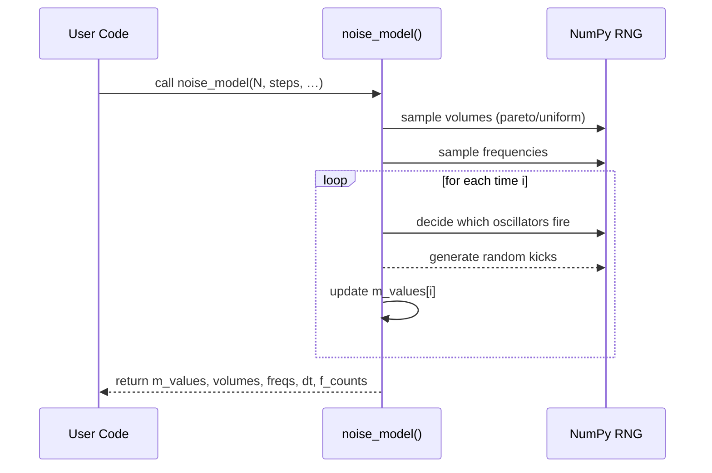

# Chapter 7: Noise Generation Models

Welcome back! In [Chapter 6: Oersted Field & Pinning Calculations](06_oersted_field___pinning_calculations_.md) we learned how to compute fields from currents and defects. Now we add a sprinkle of randomness—**noise**—to our simulations. Noise models help you mimic thermal agitation or natural fluctuations in your magnetic system, like the jiggling of molecules at finite temperature.

---

## 1. Motivation & Central Use Case

**Use Case:** You’re simulating a domain wall in a nanowire and want to include thermal noise so that the wall “wobbles” realistically. Instead of writing your own for‑loop with random kicks, you can call
`noise_model(...)` once and get back a time‑series of random fluctuations.

### What You’ll Do

1. Generate an ensemble of N tiny “domains” each with its own random fluctuations.
2. Sum these fluctuations into a single noise time‑series.
3. (Optionally) Add pink‑noise oscillations or background noise.
4. Analyze the result with an autocorrelation or power spectrum.

---

## 2. Key Concepts

1. **Ensemble Oscillators**
   We model N independent fluctuators (small volumes) that randomly kick the magnetization.
2. **Thermal Noise**
   Gaussian white noise with standard deviation `thermal_noise_std`.
3. **Volume Distribution**
   How to weight each oscillator (e.g. “pareto” for a few big volumes, or “uniform”).
4. **Frequency Distribution**
   Define each oscillator’s natural tick rate—uniformly random or a function of volume.
5. **Optional Oscillations**
   Enable coherent oscillations (pink‑noise style) by setting `enable_oscillations=True`.

---

## 3. How to Use `noise_model`

Here’s a minimal example:

```python
from cmtj.models.noise import noise_model

# Generate noise for N=100 volumes over 10 000 steps
m_values, volumes, freqs, dt, f_counts = noise_model(
    N=100,
    steps=10_000,
    thermal_noise_std=1e-3,
    background_thermal_noise_std=0.0,  # no background
    enable_oscillations=False,
    volume_distribution="pareto",
    freq_distribution="uniform",
    seed=123
)

print("m_values shape:", m_values.shape)
print("dt (s):", dt)
```

Explanation:

- **Inputs**:
  - `N`: number of fluctuators.
  - `steps`: total time‑steps.
  - `thermal_noise_std`: strength of the random kicks.
- **Outputs**:
  - `m_values`: array of shape `(steps, dims)`, the summed noise at each time.
  - `volumes`: weight of each oscillator.
  - `freqs`: their assigned frequencies.
  - `dt`: time between steps.
  - `f_counts`: how many times each oscillator “fired.”

---

## 4. Visualizing the Noise

We can plot autocorrelation, the PSD, and the time series in one go:

```python
from cmtj.models.noise import plot_noise_data

# plot_noise_data returns a Matplotlib figure
fig = plot_noise_data(m_values, volumes, freqs, dt)
fig.show()
```

- **Panel a)** autocorrelation vs time lag
- **Panel b)** volume vs activation count
- **Panel c)** power spectral density (log–log)
- **Panel d)** raw noise vs time

---

## 5. Under the Hood: What Happens When You Call `noise_model`?



1. **Volume & frequency assignment**
2. **Time loop** deciding random triggers
3. **Gaussian noise** added when triggered
4. **Summation** into `m_values`

---

## 6. A Peek at the Implementation

File: `cmtj/models/noise.py`
Here’s a simplified skeleton:

```python
def noise_model(N, steps=1000, thermal_noise_std=1e-3, …):
    rng = np.random.default_rng()
    # 1) pick volumes
    if volume_distribution=="pareto":
        volumes = rng.gamma(shape, scale, size=N)
    else:
        volumes = rng.random(N)
        volumes /= volumes.sum()
    # 2) pick frequencies
    if freq_distribution=="uniform":
        freqs = rng.integers(low, high, N)
    # prepare output
    m_values = np.zeros((steps, 1))
    f_counts = np.zeros(N, int)

    # 3) main loop
    for i in range(steps):
        # choose which oscillators fire this step
        mask = (i % freqs)==0
        if mask.any():
            # each firing oscillator gets a random kick
            kicks = rng.normal(0, thermal_noise_std, mask.sum())
            m_values[i] = np.sum(volumes[mask]*kicks)
            f_counts[mask] += 1
        else:
            m_values[i] = m_values[i-1]
    return m_values, volumes, freqs, time_scale, f_counts
```

- We only keep a 1D noise trace (`dims=1`) for simplicity.
- Real code also supports `dims=3`, background noise, oscillations, and saves individual vectors if asked.

---

## 7. Next Steps & Conclusion

You’ve learned how to:

- Use **`noise_model`** to generate realistic thermal or pink‑noise fluctuations.
- Visualize and analyze noise via autocorrelation and spectral plots.
- Peek under the hood at how volumes and triggers combine into a time‑series.

Up next, we’ll clean up these noisy signals with **[Signal Filters](08_signal_filters_.md)**—learning how to focus on the frequencies that matter. Have fun adding realistic “jiggles” to your simulations!

---

Generated by [AI Codebase Knowledge Builder](https://github.com/The-Pocket/Tutorial-Codebase-Knowledge)
