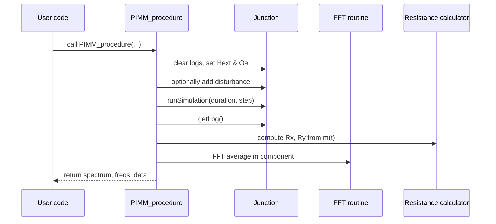

# Chapter 1: PIMM & VSD Procedures

Welcome to the first chapter! Here we learn how to automate two common micromagnetic experiments—**PIMM** (Pulse‑Induced Microwave Magnetometry) and **VSD** (Voltage Spin Diode)—using high‑level “recipes” in `cmtj`. These procedures orchestrate many low‑level steps (setting fields, running simulations, computing resistances, doing FFTs) so you can focus on “what” you want to measure, not “how” to do every detail.

---

## 1. Motivation & Central Use Case

Imagine you have a magnetic junction and you want to:

1. Apply a short magnetic pulse.
2. Record how the magnetization rings down (that’s PIMM).
3. Sweep frequencies of a sinusoidal drive and measure the spin‑diode voltage (that’s VSD).

Writing all the boilerplate to set fields, run the solver, extract logs, do FFTs, combine layers… is tedious.
**PIMM_procedure** and **VSD_procedure** let you do this in one call.

Use case in code:

```python
from cmtj.utils.procedures import PIMM_procedure, VSD_procedure, ResistanceParameters
import numpy as np

# 1. Define a small field scan:
Hvecs = np.array([[0,0,1e5], [0,0,1.2e5]])

# 2. Define resistance parameters per layer (length, width, base resistances…)
res_params = [ResistanceParameters(Rxx0=100, Rxy0=5, Rahe=1, Ramr=0.5, w=50e-9, l=100e-9)]

# 3. Call PIMM:
spectrum, freqs, data = PIMM_procedure(junction, Hvecs, 1e-12, res_params)

# 4. Call VSD at some frequencies:
freqs_to_test = np.linspace(1e9, 10e9, 50)
vsd_map = VSD_procedure(junction, Hvecs, freqs_to_test, 1e-12, res_params)
```

After that you get:

- `spectrum`: PIMM amplitudes vs frequency
- `freqs`: the frequency axis
- `data["Rx"]`, `data["Ry"]`, `data["m_avg"]`… for further analysis
- `vsd_map`: a 2D array of spin‑diode voltages vs field & frequency

---

## 2. Key Concepts

1. **Junction**
   Your magnetic system (see [Magnetic Layer Models](04_magnetic_layer_models__layersb___layerdynamic__.md)).
2. **Drivers**
   - **External field**: constant H<sub>ext</sub>
   - **Oersted field**: pulse (PIMM) or sine (VSD) via `ScalarDriver` + `AxialDriver`
3. **ResistanceParameters**
   Holds geometry + magnetoresistance coefficients for each layer.
4. **FFT & Spectrum**
   We take the time‑series of magnetization projection, run an FFT, and keep frequencies ≤ `max_frequency`.

---

## 3. How to Run PIMM & VSD

### 3.1 PIMM Procedure (High‑Level)

```python
spectrum, freqs, other = PIMM_procedure(
    junction=your_junction,
    Hvecs=Hvecs,
    int_step=1e-12,
    resistance_params=res_params,
    Hoe_duration=5,        # pulse length in #steps
    simulation_duration=5e-9,
    take_last_n=200        # how many last time‑points to FFT
)
```

- **Inputs**:
  - `junction`: your initialized `Junction`
  - `Hvecs`: array of external fields
  - `int_step`: time‑step in seconds
  - `resistance_params`: list of `ResistanceParameters` per layer
- **Outputs**:
  - `spectrum[h, f]`: FFT amplitude for each H and frequency bin
  - `freqs[f]`: array of frequencies
  - `other`: dict with static Rx, Ry, average magnetization, raw trajectories if `full_output=True`

### 3.2 VSD Procedure (High‑Level)

```python
vsd_map = VSD_procedure(
    junction=your_junction,
    Hvecs=Hvecs,
    frequencies=np.linspace(1e9,5e9,30),
    int_step=1e-12,
    resistance_params=res_params,
    Hoe_excitation=40
)
```

- **Inputs**:
  - `frequencies`: drive frequencies for the sine Oersted field
  - `Rtype`: choose `"Rx"`, `"Ry"` or `"Rz"`
- **Output**:
  - `vsd_map[h, f]`: DC mixing voltage vs H and drive frequency

---

## 4. Inside PIMM_procedure: Step‑by‑Step

Before diving into code, here is what happens:



---

## 5. Peek at the Code

File: `cmtj/utils/procedures.py`

### 5.1 Building the Oersted Pulse

```python
# decide which axis gets the pulse
if Hoe_direction == Axis.zaxis:
    oedriver = AxialDriver(
      NullDriver(), NullDriver(),
      ScalarDriver.getStepDriver(0, amplitude, 0, step * duration_steps)
    )
# similar for x and y...
```

_We wrap a step‑function in a 3‑component `AxialDriver`._

### 5.2 Main Loop over H Fields

```python
for H in Hvecs:
    junction.clearLog()
    # 1) set static field
    junction.setLayerExternalFieldDriver(
      "all",
      AxialDriver(
        ScalarDriver.getConstantDriver(H[0]),
        ScalarDriver.getConstantDriver(H[1]),
        ScalarDriver.getConstantDriver(H[2]),
      ),
    )
    # 2) set Oe pulse/sine
    junction.setLayerOerstedFieldDriver("all", oedriver)
    # 3) apply small random disturbance
    # 4) junction.runSimulation(sim_dur, int_step, int_step)
    # 5) extract log, compute Rx,Ry, FFT
```

Each iteration collects:

- Static resistances (`Rx`,`Ry`) via `calculate_resistance_series`
- Spectrum of the magnetization ring‑down

---

## 6. VSD_procedure Internals

Very similar—except:

1. Uses a **sine** Oersted driver at each `frequency`
2. Computes the time‑series of R(t), multiplies by I<sub>drive</sub>(t) and integrates to get the mixing voltage via `compute_sd`.

Under the hood:

```python
dynamicI = np.sin(2 * math.pi * f * np.asarray(log["time"]))
vmix = compute_sd(R, dynamicI, int_step)
```

---

## 7. Conclusion & Next Steps

You’ve learned how **PIMM_procedure** and **VSD_procedure** hide all the low‑level plumbing required to run typical magnetization‑dynamics experiments. Next, we’ll look at how to generate the field lists (`Hvecs`) using convenient scans.

On to [FieldScan Utilities](02_fieldscan_utilities_.md)!

---

Generated by [AI Codebase Knowledge Builder](https://github.com/The-Pocket/Tutorial-Codebase-Knowledge)
