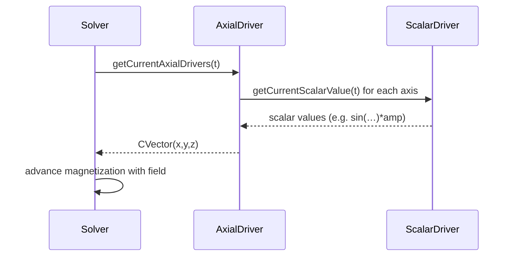

# Chapter 3: Time‑Dependent Drivers (ScalarDriver & AxialDriver)

Welcome back! In [Chapter 2: FieldScan Utilities](02_fieldscan_utilities_.md) we learned how to build lists of static field vectors. Now we’ll see how to turn those static fields into time‑varying signals—pulses, sine waves or even custom functions—using **ScalarDriver** and **AxialDriver**.

---

## 1. Motivation & Central Use Case

Imagine you want to simulate how your magnetic junction responds to:

1. A **short pulse** of Oersted field along _z_ for PIMM.
2. A **sine wave** of current (thus field) for VSD.
3. A rotating field in the _xy_‑plane.

Writing your own loop over time, computing sin(t), checking start/stop, and packing into 3‑vectors is tedious.
**ScalarDriver** and **AxialDriver** are programmable “wave machines”:

- **ScalarDriver** = one waveform (pulse, sine, custom).
- **AxialDriver** = three ScalarDrivers → 3D, applied to x/y/z.

Use case:
• Create a 1 GHz sine drive of amplitude 1×10^4 A/m along _z_ and feed it to your junction.

---

## 2. Key Concepts

1. **ScalarDriver**

   - Produces a 1D time‑series: constant, pulse, sine, custom Python callback…
   - Static constructors like `getSineDriver`, `getStepDriver`.

2. **AxialDriver**
   - Bundles three ScalarDrivers (x, y, z).
   - Helpers:
     - `getUniAxialDriver(driver, Axis.zaxis)` → apply driver on one axis.
     - `AxialDriver(driver_x, driver_y, driver_z)` → custom combo.

Analogy:

- Think of ScalarDriver as a single musical note (tone over time).
- AxialDriver is a three‑instrument chord (notes on x, y, z axes).

---

## 3. How to Use Drivers

Here’s how to set up a 1 GHz sine Oersted field on _z_:

```python
from cmtj.models.drivers import ScalarDriver, AxialDriver, Axis

# 1) Build a 1 GHz sine: offset=0, amp=1e4, freq=1e9 Hz, phase=0
sine = ScalarDriver.getSineDriver(0, 1e4, 1e9, 0)

# 2) Wrap it into an AxialDriver on z‑axis
oe_driver = AxialDriver.getUniAxialDriver(sine, Axis.zaxis)

# 3) Apply to your junction
junction.setLayerOerstedFieldDriver("all", oe_driver)

# 4) Run your simulation as usual!
junction.runSimulation(duration, time_step, time_step)
```

What happens?

- At each time `t`, the solver asks `oe_driver` for a 3‑vector.
- You get `[0, 0, sin(2π·1e9·t)*1e4]`.

You can also do a rotating _xy_ field:

```python
import math
sx = ScalarDriver.getSineDriver(0, 1e4, 1e9, 0)
sy = ScalarDriver.getSineDriver(0, 1e4, 1e9, math.pi/2)
rot = AxialDriver(sx, sy, ScalarDriver.getConstantDriver(0))
junction.setLayerExternalFieldDriver("all", rot)
```

This gives a circular field of radius 1e4 in the xy‑plane.

---

## 4. Under the Hood: Step‑by‑Step

When the simulation runs, it needs the field at each time step:



---

## 5. Driver Implementation (Simplified)

### 5.1 ScalarDriver (core logic)

File: `cmtj/models/drivers.py`

```python
class ScalarDriver:
    def __init__(self, update, constant, amp, freq, phase, callback=None):
        # store parameters…
        self.update = update
        # …

    @staticmethod
    def getSineDriver(constant, amp, freq, phase):
        return ScalarDriver('sine', constant, amp, freq, phase)

    def getCurrentScalarValue(self, t):
        val = self.constant
        if self.update == 'sine':
            val += self.amp * math.sin(2*math.pi*self.freq*t + self.phase)
        # other types (step, pulse…) are similar
        return val
```

**Explanation:**

- `getSineDriver` sets up a sine.
- `getCurrentScalarValue(t)` returns the value at time `t`.

### 5.2 AxialDriver (combines 3 scalars)

File: `cmtj/models/drivers.py`

```python
class AxialDriver:
    def __init__(self, dx, dy, dz):
        self.drivers = [dx, dy, dz]

    @staticmethod
    def getUniAxialDriver(drv, axis):
        # axis: xaxis=0, yaxis=1, zaxis=2, all=3
        vec = [NullDriver(), NullDriver(), NullDriver()]
        vec[axis.value] = drv
        return AxialDriver(*vec)

    def getCurrentAxialDrivers(self, t):
        return CVector(
            self.drivers[0].getCurrentScalarValue(t),
            self.drivers[1].getCurrentScalarValue(t),
            self.drivers[2].getCurrentScalarValue(t)
        )
```

**Explanation:**

- Stores three ScalarDrivers.
- On each call returns a `CVector(x,y,z)` of current values.

And in C++ (core/drivers.hpp) the logic mirrors this for high performance.

---

## 7. Conclusion & Next Steps

You’ve learned how to create **time‑dependent drivers** in `cmtj`:

- **ScalarDriver** for 1D waveforms (sine, pulse, custom).
- **AxialDriver** for 3‑component signals.

Now you can feed precise time patterns into your magnetization simulations. In the next chapter we’ll see how to define and manage your magnetic layers with [Magnetic Layer Models (LayerSB & LayerDynamic)](04_magnetic_layer_models__layersb___layerdynamic__.md).

---

Generated by [AI Codebase Knowledge Builder](https://github.com/The-Pocket/Tutorial-Codebase-Knowledge)
