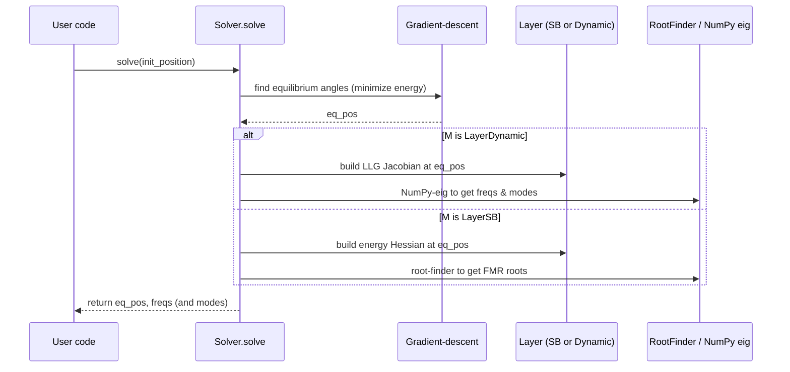

# Chapter 4: Magnetic Layer Models (LayerSB & LayerDynamic)

Welcome back! In [Chapter 3: Time‑Dependent Drivers (ScalarDriver & AxialDriver)](03_time_dependent_drivers__scalardriver___axialdriver__.md) we learned how to craft time‑varying field pulses and sine drives. Now it’s time to define **the magnetic layers** themselves—the “spinning tops” of your junction. We’ll see how to:

- Compute static **FMR frequencies** with **LayerSB** (Smit–Beljers model).
- Extend to full **LLG dynamics** (damping & torques) with **LayerDynamic**.

---

## 1. Motivation & Central Use Case

Imagine you want to:

1. Define a single ferromagnetic film with its own thickness, anisotropy and saturation (a tiny spinning top).
2. Under an applied static field, compute its **ferromagnetic‑resonance (FMR)** frequency.
3. Or include damping (α) to run full time‑domain LLG simulations later (e.g., PIMM/VSD).

Without `cmtj`, you’d have to derive energy, build Hessians, solve eigenproblems, implement gradient‐descent… a lot!
**LayerSB** and **LayerDynamic** give you ready‐made building blocks.

---

## 2. Key Concepts

- **LayerSB**
  A static, symbolic Smit–Beljers model.
  • Stores thickness, in‑plane/surface anisotropy, Ms, demag tensor.
  • Builds a symbolic energy functional.
  • Computes Hessian → FMR frequencies.

- **LayerDynamic**
  Inherits LayerSB.
  • Adds **damping** (α) and **spin‑torque** parameters.
  • Defines the RHS of the LLG equation in spherical coordinates.
  • Enables dynamic eigenmode and mode‐mixing calculations.

- **Solver**
  Takes one or more layers (SB or Dynamic), interlayer couplings J₁/J₂, external field **H**, dipoles…
  • **solve()** finds equilibrium (via Adam gradient‐descent) and then:
  – For LayerSB: finds FMR roots of the Hessian.
  – For LayerDynamic: builds the LLG Jacobian, finds dynamic eigenmodes.

---

## 3. Static FMR with LayerSB

Here’s how to compute the FMR of a **single** layer under a static field:

```python
from cmtj.models.general_sb import LayerSB, Solver
from cmtj.utils import VectorObj

# 1) Define a static layer (id=0)
layer = LayerSB(
    _id=0,
    thickness=1e-9,               # 1 nm thick
    Kv=VectorObj(1e4, 0, 0),      # in‐plane anisotropy of 1e4 J/m³ along x
    Ks=0,                         # no perpendicular surface anisotropy
    Ms=8e5                        # saturation magnetisation [A/m]
)

# 2) Build a solver around this layer (no coupling J1,J2)
solver = Solver(layers=[layer], J1=[], J2=[])

# 3) Apply an external field H = (0,0,1e5) A/m
solver.set_H(VectorObj(0, 0, 1e5))

# 4) Solve for equilibrium angles and FMR frequency
#    init_position = [θ0, φ0] in radians
eq_pos, freqs = solver.solve(init_position=[0.0, 0.0])

print("Equilibrium (θ,φ):", eq_pos)
print("FMR frequency (GHz):", freqs)
```

Explanation:

1. We create a **LayerSB** with basic magnetic properties.
2. We wrap it in a **Solver**, set **H**, then call `solve()`.
3. Under the hood, `solve` finds the minimum of the energy, builds the Hessian, finds its eigen‑roots → FMR.

---

## 4. Dynamic LLG with LayerDynamic

To include damping (α) and torques for full LLG dynamics, swap in **LayerDynamic**:

```python
from cmtj.models.general_sb import LayerDynamic

# 1) Define a dynamic layer
layer_dyn = LayerDynamic(
    _id=0,
    thickness=1e-9,
    Kv=VectorObj(1e4, 0, 0),
    Ks=0,
    Ms=8e5,
    alpha=0.02,     # Gilbert damping
    torque_par=0,   # no extra spin torque
    torque_perp=0
)

# 2) Build the solver
solver_dyn = Solver(layers=[layer_dyn], J1=[], J2[])
solver_dyn.set_H(VectorObj(0, 0, 1e5))

# 3) Solve: returns (eq_pos, freqs, modes)
eq_dyn, freqs_dyn, modes = solver_dyn.solve(init_position=[0.0, 0.0])

print("Dynamic FMR (GHz):", freqs_dyn)
# 'modes' holds the eigenvectors for each excited mode
```

Now `solve()` spots that the layer is dynamic, builds the LLG Jacobian, and returns **both** frequencies and mode vectors for time‑domain behavior.

---

## 5. What Happens Under the Hood?

Here’s a simplified view of `Solver.solve()` in action:



- **Step 1**: Gradient‐descent locates the energy minimum (`θ_eq, φ_eq`).
- **Step 2**:
  - **LayerSB** → symbolic Hessian → numeric root‐finding → FMR.
  - **LayerDynamic** → LLG Jacobian → eigen‐decomposition → dynamic modes.

---

## 6. A Peek at the Source

All lives in `cmtj/models/general_sb.py`. Here’s a toy sketch of `solve()`:

```python
def solve(self, init_position):
    # 1) equilibrium
    eq = self.adam_gradient_descent(init_position)
    # 2) if dynamic → LLG eigenmodes
    if isinstance(self.layers[0], LayerDynamic):
        return eq, *self.dynamic_layer_solve(eq)
    # 3) else static → FMR roots
    return eq, self.num_solve(eq)
```

And static‐FMR calls something like:

```python
def num_solve(self, eq):
    hes_det = self.create_energy_hessian(eq)      # symbolic Hessian det
    roots = RootFinder(...).find(hes_det)         # find ω‐roots
    return np.unique(np.round(roots/1e9,2))       # in GHz
```

---

## 7. Conclusion & Next Steps

You’ve now met **LayerSB** and **LayerDynamic**—the core building blocks for defining magnetic layers in `cmtj`. You know how to:

- Instantiate static layers and compute Smit–Beljers FMR.
- Instantiate dynamic layers with damping & torques for full LLG eigenmode analysis.

Next up: handling **domain‐wall dynamics** across multiple layers in [Chapter 5: Domain Wall Dynamics (DomainWallDynamics & MultilayerWallDynamics)](05_domain_wall_dynamics__domainwalldynamics___multilayerwalldynamics__.md).

---

Generated by [AI Codebase Knowledge Builder](https://github.com/The-Pocket/Tutorial-Codebase-Knowledge)
