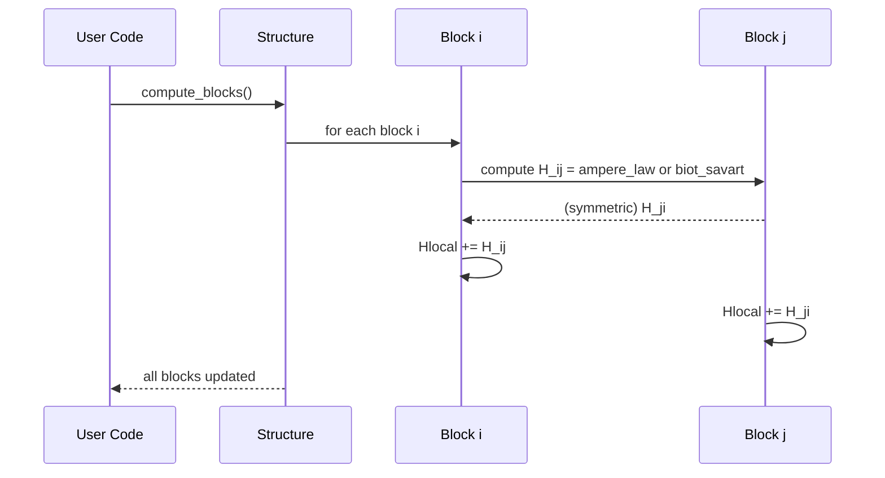

# Chapter 6: Oersted Field & Pinning Calculations

Welcome back! In [Chapter 5: Domain Wall Dynamics](05_domain_wall_dynamics__domainwalldynamics___multilayerwalldynamics__.md) we learned how to move and couple domain walls. Now, before we drive walls with currents or fields, we need to know:

- How the conductor’s own current **generates** magnetic fields (Oersted fields).
- How imperfections in the wire create a **pinning potential** that can block wall motion.

Imagine slicing your wire into a 2D or 3D grid of tiny cubes. Each cube carries some current and “whispers” a magnetic field to its neighbors. Then, if there are rough spots, they create little hills and valleys in an energy landscape that can **pin** (trap) the wall.

In this chapter you’ll learn how to:

1. Build a `Structure` of blocks representing your conductor.
2. Assign currents to regions.
3. Compute local Oersted fields via **Ampère’s law** or **Biot–Savart**.
4. Extract pinning fields or energies for domain walls.

---

## 1. Motivation & Central Use Case

Use case:
You have a rectangular stripe, 200 nm wide, 5 nm thick. You drive 1 mA along its length and want to know:

1. What’s the spatial map of the Oersted field across the stripe?
2. How strong is the pinning at a defect located at y = 50 nm?

With this information you can predict where a domain wall will stall or how much current you need to overcome pinning.

---

## 2. Key Concepts

1. **Block**
   A little cube (dx×dy×dz) that:

   - Knows its center `(x,y,z)`.
   - Carries a local current `I`.
   - Accumulates its self‐field `Hlocal`.

2. **Structure**
   A 2D/3D array of `Block` objects filling your conductor.

   - `Structure.set_region_I` divides the total current among blocks in a stripe.
   - `Structure.compute_blocks` loops over all block pairs and applies either:
     - **Ampère’s law** (for 2D sheets)
     - **Biot–Savart law** (for 3D volumes)

3. **Pinning Potential**
   By summing Oersted contributions over a local region around a defect, you get an extra local field or energy barrier that acts like a pinning site.

---

## 3. How to Use in Code

Below is a minimal example for our 200 nm×100 nm stripe:

```python
from cmtj.models.oersted import Structure

# 1) Build a 200×100 nm stripe with 10×5 nm blocks (2×20 blocks)
stripe = Structure(
    maxX=200e-9, maxY=100e-9, maxZ=5e-9,
    dx=10e-9, dy=5e-9, dz=5e-9,
    method="ampere"   # use Ampère’s law in 2D
)

# 2) Send I=1 mA through stripe (uniform in y from 0 to 100 nm)
stripe.set_region_I(I=1e-3, min_y=0, max_y=100e-9)

# 3) Compute the Oersted field on each block
stripe.compute_blocks()

# 4) Get the total field acting near y=50 nm (pinning region)
H_pin = stripe.compute_region_contribution(
    source_min_y=0, source_max_y=100e-9,
    target_min_y=45e-9, target_max_y=55e-9
)
print(f"Pinning field near y=50 nm: {H_pin:.2e} A/m")

# 5) Visualize the full field map
field_map = stripe.show_field(log=False)
```

Explanation:

- We divide the stripe into 2×20 blocks.
- `set_region_I` shares the 1 mA evenly across all blocks.
- `compute_blocks` loops over pairs and adds up each block’s contribution.
- We then query the field near y = 50 nm to see how strong the “pin” is.
- Finally, `show_field` gives a nice 2D color plot of the Oersted field.

---

## 4. Under the Hood: Step‑by‑Step

Here’s what happens when you call `stripe.compute_blocks()`:



1. **Loop pairs**: We take every pair of blocks (i,j).
2. **Compute field**: Block i whispers to block j and vice versa.
3. **Accumulate**: Each block adds the computed field to its `Hlocal`.

---

## 5. Peeking at the Implementation

File: `cmtj/models/oersted.py`

### 5.1 Simplified `Block` class

```python
class Block:
    def __init__(self, ix, iy, iz, dx, dy, dz):
        self.x = (ix+0.5)*dx  # center
        self.y = (iy+0.5)*dy
        self.z = (iz+0.5)*dz
        self.area = dx*dy
        self.dl = dz
        self.I = 0
        self.Hlocal = 0

    def set_I(self, I):
        self.I = I

    def ampere_law(self, other):
        #  H = I / (2πr)
        r = ((self.x-other.x)**2 + (self.y-other.y)**2)**0.5
        return other.I/(2*math.pi*r)

    def biot_savart(self, other):
        # 3D version, H ∼ I * area * dl / r^2
        r2 = (self.x-other.x)**2 + (self.y-other.y)**2
        return other.I*other.area*self.dl/(4*math.pi*r2) if r2>0 else 0
```

**Explanation:**

- The block stores its center and current.
- Two methods implement Ampère vs Biot–Savart.
- Both return a scalar field `H` at this block from `other`.

### 5.2 Simplified `Structure` setup and compute

```python
class Structure:
    def __init__(self, maxX, maxY, maxZ, dx, dy, dz, method):
        self.Xsize = ceil(maxX/dx)
        self.Ysize = ceil(maxY/dy)
        self.Zsize = max(ceil(maxZ/dz),1)
        self.blocks = [[[Block(i,j,k,dx,dy,dz)
                         for k in range(self.Zsize)]
                        for j in range(self.Ysize)]
                       for i in range(self.Xsize)]
        self.method = method

    def set_region_I(self, I, min_y, max_y):
        # equally split I over blocks with y in [min_y,max_y]
        # …

    def compute_blocks(self):
        for i in range(len(self.blocks)):
          for j in range(len(self.blocks)):
            for k in range(len(self.blocks[i])):
              b1 = self.blocks[i][j][k]
              for ii in range(i,len(self.blocks)):
                for jj in range(len(self.blocks[ii])):
                  for kk in range(len(self.blocks[ii][jj])):
                    b2 = self.blocks[ii][jj][kk]
                    if b1 is b2: continue
                    # pick law:
                    H = (b1.ampere_law(b2) if self.method=="ampere"
                         else b1.biot_savart(b2))
                    b1.Hlocal += H
                    b2.Hlocal += H
```

---

## 6. Visualizing Pinning as an Energy Hill

Once you compute `Hlocal` across the stripe, you can convert it into a local energy barrier for a domain wall:

- The pinning **force** ∼ 2 Mₛ t H<sub>pin</sub>.
- Where `t` is thickness, `Hpin` from `compute_region_contribution`.

Plot `Hpin` vs y to see where your wall will buckle under current.

```mermaid
graph LR
  A[Blocks with Hlocal] --> B[Pinning Field map]
  B --> C[Compute F_pin(y)]
  C --> D[Energy barrier vs position]
```

---

## 7. Conclusion & Next Steps

You’ve learned how to:

- Dissect your conductor into tiny **blocks** that carry current and generate fields.
- Use **Ampère’s law** or **Biot–Savart** to compute local Oersted fields.
- Extract a **pinning field** for specific regions where domain walls might get stuck.

Armed with this, you can now predict how much current is needed to free a domain wall from a defect. Next up, we’ll add thermal fluctuations with [Noise Generation Models](07_noise_generation_models_.md).

---

Generated by [AI Codebase Knowledge Builder](https://github.com/The-Pocket/Tutorial-Codebase-Knowledge)
