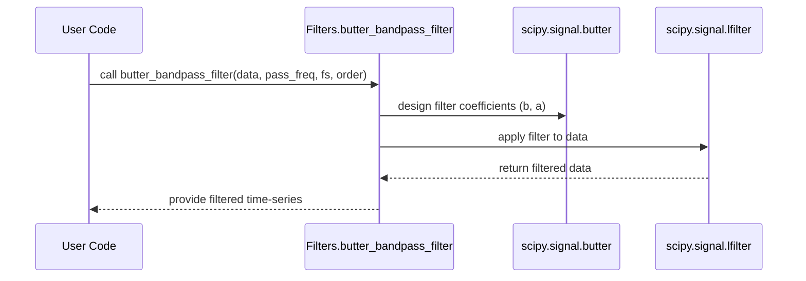

# Chapter 8: Signal Filters

Welcome back! In [Chapter 7: Noise Generation Models](07_noise_generation_models_.md) we added realistic thermal or pink‐noise fluctuations to our simulations. Now these time‐series can be quite messy. In this chapter, we’ll learn how to **clean** and **focus** on the frequencies you care about by using **signal filters**—much like an audio equalizer weeds out hiss or hum so you only hear the melody.

---

## 1. Motivation & Central Use Case

Imagine you’ve recorded a voltage signal from your junction and the raw trace looks like this:

- A slow drift (baseline)
- A 50 Hz pickup from the power line
- High‑frequency thermal jitters

You want to:

1. **Remove** the slow drift.
2. **Suppress** the 50 Hz hum.
3. **Keep** the dynamic response between 100 Hz and 10 kHz.

With **signal filters** you can do all three in just a few lines of code.

---

## 2. Key Concepts

1. **Butterworth Band‑Pass Filter**
   - A smooth filter that only passes a frequency band you choose (e.g. 100 Hz–10 kHz).
2. **Butterworth Low‑Pass Filter**
   - Lets through frequencies below a cutoff (e.g. remove everything above 20 kHz).
3. **Detrending**
   - Removes slow drifts or offsets by subtracting the median or linear trend.

Think of your raw data as a tangled rope.

- **Band‑pass** picks out only the middle section you care about.
- **Low‑pass** chops off the noisy high‑frequency ends.
- **Detrend** straightens the rope so its middle is level.

---

## 3. How to Use Filters: A Minimal Example

Below is a simple workflow. Suppose you have:

- `raw_signal`: a NumPy array of voltage vs. time
- `fs`: sampling frequency in Hz (e.g. 50 000 Hz)

```python
import numpy as np
import matplotlib.pyplot as plt
from cmtj.utils.filters import Filters

# 1) Create a noisy test signal
t = np.linspace(0, 1, 50000)  # 1 s at 50 kHz
clean = np.sin(2*np.pi*1000*t)          # 1 kHz tone
hum   = 0.5*np.sin(2*np.pi*50  *t)      # 50 Hz hum
noise = 0.2*np.random.randn(len(t))     # white noise
raw_signal = clean + hum + noise

# 2) Apply a band‑pass from 100 Hz to 10 kHz
bp = Filters.butter_bandpass_filter(
    data=raw_signal,
    pass_freq=(100, 10000),
    fs=50000,
    order=4
)

# 3) Detrend to remove baseline drift
filtered = Filters.detrend_axis(bp, axis=0)

# 4) Plot raw vs filtered
plt.plot(t, raw_signal, alpha=0.3, label="raw")
plt.plot(t, filtered,     label="filtered")
plt.legend()
plt.show()
```

Explanation:

1. We build a synthetic signal with a 1 kHz tone, 50 Hz hum, and random noise.
2. `butter_bandpass_filter` keeps only 100 Hz–10 kHz.
3. `detrend_axis` subtracts the median so the baseline sits at zero.
4. The final plot shows the clean 1 kHz oscillation without drift or hum.

---

## 4. Under the Hood: What Happens When You Call a Filter

Here’s a high‑level view of `butter_bandpass_filter`:



1. **Design**: Butterworth analog prototype → digital coefficients `b, a`.
2. **Apply**: `lfilter(b, a, data)` runs the filter over your array.
3. **Return**: You get back a cleaned array of the same length.

---

## 5. Peeking into the Implementation

All of this lives in `cmtj/utils/filters.py`. Here are the core pieces, simplified:

```python
# File: cmtj/utils/filters.py
import numpy as np
from scipy.signal import butter, lfilter

class Filters:
    @staticmethod
    def butter_bandpass_filter(data, pass_freq, fs, order=5):
        nyq = 0.5 * fs
        low, high = pass_freq[0]/nyq, pass_freq[1]/nyq
        # design band‑pass filter
        b, a = butter(order, [low, high], btype="bandpass")
        # apply filter
        return lfilter(b, a, data)

    @staticmethod
    def butter_lowpass_filter(data, cutoff, fs, order=5):
        nyq = 0.5 * fs
        norm_cut = cutoff / nyq
        b, a = butter(order, norm_cut, btype="low")
        return lfilter(b, a, data)

    @staticmethod
    def detrend_axis(arr, axis):
        med = np.median(arr, axis=axis)
        # subtract median along the chosen axis
        return (arr.T - med).T if axis else arr - med
```

- We first **normalize** frequencies by the Nyquist rate (`fs/2`).
- We call SciPy’s `butter` to get filter polynomials.
- Then `lfilter` runs the actual smoothing.
- `detrend_axis` subtracts the median to remove slow drifts.

---

## 6. Conclusion & Next Steps

You’ve now learned how to:

- Apply **Butterworth band‑pass** and **low‑pass** filters to isolate your frequency band of interest.
- **Detrend** your data to remove baseline drifts.
- Peek under the hood at how these filters are designed and applied in `cmtj`.

With your signals now clean and focused, the next chapter will introduce **Vector Objects**—a handy way to manipulate multi‑component data like 3D field arrays. Onward to [Chapter 9: Vector Objects (CVector & VectorObj)](09_vector_objects__cvector___vectorobj__.md)!

---

Generated by [AI Codebase Knowledge Builder](https://github.com/The-Pocket/Tutorial-Codebase-Knowledge)
