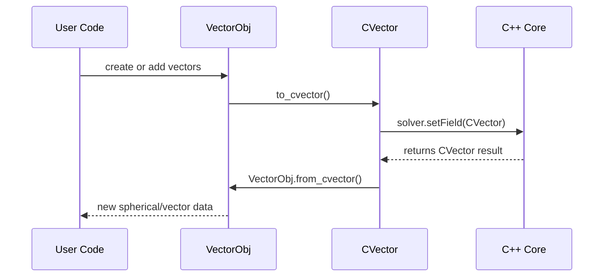

# Chapter 9: Vector Objects (CVector & VectorObj)

In [Chapter 8: Signal Filters](08_signal_filters_.md) we learned how to clean up time‑series data. Now we introduce **Vector Objects**—our universal “arrow” type for pointing in 3D space. Whether you’re in Python or C++, you’ll use these to represent magnetic moments, fields, displacements, or any directional quantity.

---

## 1. Motivation & Central Use Case

Imagine you want to:

1. Define a magnetic field that’s 1×10⁵ A/m at a 30° tilt from the z‑axis.
2. Rotate it by 90° around z and add another field.
3. Feed that vector into a C++ solver or Python routine seamlessly.

Rather than juggling 3‑tuples manually, **VectorObj** (Python) and **CVector** (C++) give you a clean API to:

- Store in **spherical** (θ, φ, magnitude) or **Cartesian** (x, y, z).
- **Convert** back and forth.
- **Add**, **scale**, **normalize** with intuitive operators.

By the end of this chapter you’ll be able to build and manipulate these “arrows” without worrying about the math under the hood.

---

## 2. Key Concepts

1. **Cartesian vs Spherical**

   - Cartesian: (x, y, z) components.
   - Spherical: (θ polar, φ azimuth, r magnitude).

2. **CVector** (C++ core)

   - High‑performance templated class.
   - Use in C++ simulation code.
   - Operators: `+`, `-`, `*`, `/`, `normalize()`, `length()`, `fromSpherical()`.

3. **VectorObj** (Python)

   - Dataclass wrapping spherical coords.
   - Methods: `to_cvector()`, `from_cvector()`, `get_cartesian()`, `from_cartesian()`.
   - Overloaded `+`, `*` for easy math.

4. **Seamless Conversion**
   - Python `VectorObj.to_cvector()` → C++ `CVector` for passing into the core.
   - `VectorObj.from_cvector()` reads back results.

---

## 3. How to Use Vector Objects

### 3.1 Python: VectorObj

```python
from cmtj.utils.general import VectorObj

# 1) Create from spherical coords (θ,φ in radians, r)
v1 = VectorObj(theta=30*np.pi/180, phi=0, mag=1e5)

# 2) Rotate around z by 90° (add another vector)
v2 = VectorObj(theta=30*np.pi/180, phi=np.pi/2, mag=1e5)
v_total = v1 + v2

# 3) Normalize and scale
v_norm = v_total * (1 / v_total.mag)  # unit vector
v_scaled = v_norm * 5e4

# 4) Convert to CVector to pass to C++ core
cv = v_scaled.to_cvector()
# cv is now a CVector(x, y, z)
```

Explanation:

- We built two 3D vectors in spherical form and added them.
- We normalized and scaled to get desired magnitude.
- Finally we turned it into a `CVector` ready for the solver.

### 3.2 C++: CVector

```cpp
#include "cvector.hpp"

int main() {
  // 1) Build from Cartesian
  CVector<double> a(1.0, 2.0, 3.0);

  // 2) Build from spherical: θ=π/4, φ=π/2, r=5
  auto b = CVector<double>::fromSpherical(M_PI/4, M_PI/2, 5.0);

  // 3) Add and normalize
  CVector<double> c = a + b;
  c.normalize();

  // 4) Scale by 2
  CVector<double> d = c * 2.0;

  std::cout << "Result: " << d << std::endl;
}
```

Explanation:

- `fromSpherical` sets `x = r sin θ cos φ`, etc.
- `operator+` and `operator*` make vector math concise.
- `normalize()` rescales to unit length.

---

## 4. Under the Hood

When you call `VectorObj.to_cvector()` or `CVector::fromSpherical`, here’s the flow:



1. **User Code** builds or combines Python `VectorObj`.
2. `to_cvector()` converts spherical → Cartesian inside Python.
3. The C++ **Core** receives `CVector` and runs high‑speed routines.
4. Results come back as `CVector`, and `from_cvector()` wraps them into Python `VectorObj` again.

---

## 5. Peek at the Implementation

### 5.1 VectorObj conversions (simplified)

```python
# File: cmtj/utils/general.py
@dataclass
class VectorObj:
    theta: float; phi: float; mag: float = 1

    def get_cartesian(self):
        return [
          self.mag * math.sin(self.theta) * math.cos(self.phi),
          self.mag * math.sin(self.theta) * math.sin(self.phi),
          self.mag * math.cos(self.theta),
        ]

    def to_cvector(self):
        x,y,z = self.get_cartesian()
        return CVector(x, y, z)

    @staticmethod
    def from_cvector(cv):
        r = cv.length()
        if r == 0: return VectorObj(0, 0, 0)
        theta = math.acos(cv.z / r)
        phi   = math.atan2(cv.y, cv.x)
        return VectorObj(theta, phi, r)
```

Explanation:

- `get_cartesian()` does the math.
- `to_cvector()` wraps it into the C++ class.
- `from_cvector()` reads back length and angles.

### 5.2 CVector spherical factory (simplified)

```cpp
// File: core/cvector.hpp
static CVector<T> fromSpherical(T θ, T φ, T r=1) {
  return CVector<T>(
    r * sin(θ) * cos(φ),
    r * sin(θ) * sin(φ),
    r * cos(θ)
  );
}
```

Explanation:

- Identical spherical→Cartesian formula in the C++ core.
- Since both sides use the same math, conversions are lossless.

---

## Conclusion & Next Steps

You’ve learned how to represent and manipulate **3D vectors** in both Python and C++:

- Python’s **VectorObj**: easy spherical storage + Pythonic operators.
- C++’s **CVector**: high‑performance core class with the same API.
- Seamless **to_cvector** and **from_cvector** conversions.

Next, we’ll see how to tie all these pieces into a full micromagnetic calculation with the [SB Solver](10_sb_solver__solver__.md).

---

Generated by [AI Codebase Knowledge Builder](https://github.com/The-Pocket/Tutorial-Codebase-Knowledge)
