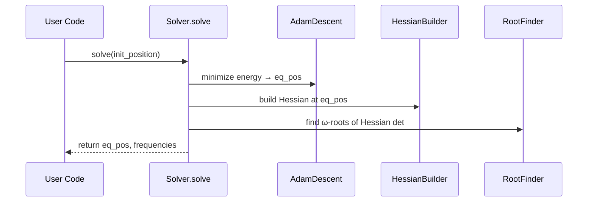

# Chapter 10: SB Solver (Solver)

Welcome back! In [Chapter 9: Vector Objects (CVector & VectorObj)](09_vector_objects__cvector___vectorobj__.md) we learned how to represent 3D vectors cleanly. Now we’ll bring everything together to **find the natural oscillations** of one or more magnetic layers under an applied field. Meet the **SB Solver**, your “resonance detective” – it builds the energy, finds equilibrium, then shakes the system to extract FMR frequencies.

---

## 1. Motivation & Central Use Case

Imagine you have a stack of thin magnetic films (layers), each with its own anisotropy and saturation. You want to:

1. Sweep an external field **H** from 0 to 1×10⁵ A/m.
2. For each H, find the equilibrium magnetization angles (θ, φ).
3. Compute the ferromagnetic‑resonance (FMR) frequencies.

Instead of deriving Hessians yourself, the **Solver** automates:

- Constructing the total energy (Zeeman, anisotropy, IEC…).
- Finding the minimum via **Adam** or **AMSGrad** gradient descent.
- Building the Hessian (or LLG Jacobian) at equilibrium.
- Solving for resonance frequencies (analytically for 1 layer, numerically for many).

By the end, you’ll know how to call one simple routine to get equilibrium and FMR vs field.

---

## 2. Key Concepts

1. **Layers**

   - **LayerSB**: static Smit–Beljers model (no damping).
   - **LayerDynamic**: adds damping & spin‑torques (uses LLG Jacobian).

2. **Solver**

   - Takes a list of layers, interlayer couplings **J1**, **J2**, optional DMI and dipoles.
   - `set_H(VectorObj)`: sets the external field.
   - `solve(init_position)`: returns equilibrium angles and FMR frequencies (and modes if dynamic).

3. **Gradient Descent**

   - Uses **Adam** (or **AMSGrad**) to minimize the symbolic energy and find (θ_eq, φ_eq).

4. **Resonance Extraction**
   - **LayerSB**: builds the Hessian of the energy and finds its ω‑roots.
   - **LayerDynamic**: builds the LLG Jacobian and finds eigenvalues → im(ω).

---

## 3. Solving the Use Case: Example Code

Below is the minimal code to scan a single layer’s FMR vs **H_z**:

```python
from cmtj.models.general_sb import LayerSB, Solver
from cmtj.utils.general import VectorObj
import numpy as np

# 1) Define a layer
layer = LayerSB(
    _id=0,
    thickness=1e-9,
    Kv=VectorObj(theta=0, phi=0, mag=1e4),
    Ks=0,
    Ms=8e5
)

# 2) Make a solver with no coupling (single layer)
solver = Solver(layers=[layer], J1=[], J2=[])

# 3) Field scan: H_z from 0 → 1e5 A/m in 5 steps
Hz = np.linspace(0, 1e5, 5)
for h in Hz:
    solver.set_H(VectorObj(theta=0, phi=0, mag=h))
    eq_pos, freqs = solver.solve(init_position=[0, 0])
    print(f"H={h:.1e} A/m → FMR (GHz) = {freqs}")
```

Explanation:

- We made one **LayerSB** with easy anisotropy.
- Wrapped it in a **Solver** (lists **J1**, **J2** must each have length 0).
- For each field, `solve` returns `[θ_eq, φ_eq]` and a list of frequencies in GHz.

---

## 4. Under the Hood: Step‑by‑Step

Here’s a simplified sequence when you call `solver.solve(...)`:



1. **Energy**: symbolic expression from each layer and couplings.
2. **Gradient descent** finds the minimum spin angles.
3. **Hessian**: second derivatives of energy at equilibrium.
4. **Root‐finding** extracts FMR modes.

---

## 5. A Peek into the Implementation

File: `cmtj/models/general_sb.py`

Below is a toy version of `solve()` and numerical‐solve:

```python
def solve(self, init_position):
    # 1) find minimum
    eq = self.adam_gradient_descent(init_position, max_steps=1e5)
    # 2) single‐layer analytic?
    if len(self.layers) == 1:
        f = self.single_layer_resonance(0, eq) / 1e9
        return eq, [f]
    # 3) multi‐layer numeric
    return self.num_solve(eq)

def num_solve(self, eq):
    # build determinant of Hessian at eq
    det_fn = lambdify(omega, self.create_energy_hessian(eq))
    roots = RootFinder(0, max_freq, step=ftol).find(det_fn)
    # convert to GHz
    return np.unique(np.round(roots/1e9,2))
```

- `adam_gradient_descent` returns the 1D array of angles.
- `create_energy_hessian` builds a symbolic Hessian and substitutes `eq`.
- We find the ω where `det(H)=0`.

---

## 6. Conclusion

You’ve learned how to use the **SB Solver** in `cmtj` to:

- Define one or more magnetic layers with **LayerSB** or **LayerDynamic**.
- Set up interlayer couplings **J1**, **J2**.
- Sweep an external field **H** and call `solver.solve` to get equilibrium and FMR frequencies.

This closes our core tutorial. Happy resonating!

---

Generated by [AI Codebase Knowledge Builder](https://github.com/The-Pocket/Tutorial-Codebase-Knowledge)
