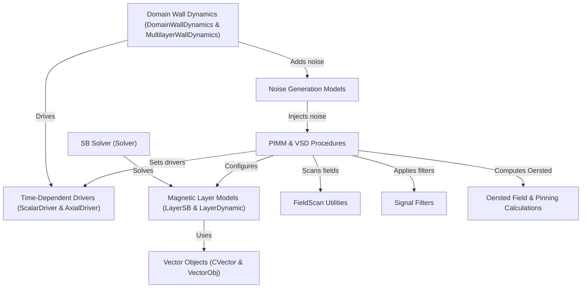

# Tutorial: cmtj

**cmtj** is a _modular_ Python/C++ toolbox for simulating a wide range of nanoscale magnetic phenomena.
It uses **3D vector objects** and **time‑dependent drivers** to feed _Landau–Lifshitz–Gilbert_ solvers for both uniform **layer models** and **domain wall dynamics**.
You can perform **field scans**, inject **noise**, compute **Oersted fields**, apply **signal filters**, and orchestrate complete **PIMM & VSD experiments** via high‑level procedures.

**Source Repository:** [https://github.com/LemurPwned/cmtj](https://github.com/LemurPwned/cmtj)

## Chapters

1. [PIMM & VSD Procedures
   ](01_pimm___vsd_procedures_.md)
2. [FieldScan Utilities
   ](02_fieldscan_utilities_.md)
3. [Time‑Dependent Drivers (ScalarDriver & AxialDriver)
   ](03_time_dependent_drivers__scalardriver___axialdriver__.md)
4. [Magnetic Layer Models (LayerSB & LayerDynamic)
   ](04_magnetic_layer_models__layersb___layerdynamic__.md)
5. [Domain Wall Dynamics (DomainWallDynamics & MultilayerWallDynamics)
   ](05_domain_wall_dynamics__domainwalldynamics___multilayerwalldynamics__.md)
6. [Oersted Field & Pinning Calculations
   ](06_oersted_field___pinning_calculations_.md)
7. [Noise Generation Models
   ](07_noise_generation_models_.md)
8. [Signal Filters
   ](08_signal_filters_.md)
9. [Vector Objects (CVector & VectorObj)
   ](09_vector_objects__cvector___vectorobj__.md)
10. [SB Solver (Solver)
    ](10_sb_solver__solver__.md)

---

Generated by [AI Codebase Knowledge Builder](https://github.com/The-Pocket/Tutorial-Codebase-Knowledge)
